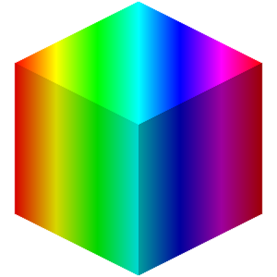

# Color Blocks
Solid color blocks for your builds.

## Features
- Solid color blocks that can represent [24-bit colors](https://en.wikipedia.org/wiki/Color_depth#True_color_(24-bit))
- Support for color animations with customizable speed
- A customization menu within color blocks to change the main color, color frames, and animation speed
- Color block presets for [139 CSS colors](https://www.w3schools.com/colors/colors_names.asp) and [16 Minecraft colors](https://minecraft.wiki/w/Dye#Color_values)

## License
This project is licensed under the [MIT License](./LICENSE).